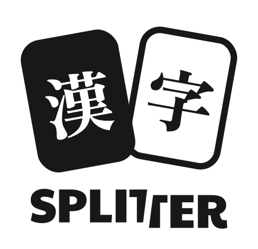

<h1 align="center">
Kanji Splitter
</h1>

<h1 align="center">

<picture>
  <source srcset="./docs/assets/logo-dark-mode.svg" 
  media="(prefers-color-scheme: dark)"
  height=300
  >
  
</picture>

</h1>

<h4 align="center">An <a href="https://apps.ankiweb.net/">Anki</a> add-on that breaks down kanji cards into their components and adds them to your deck. </h4>

---

This add-on is **not** an official Anki add-on and is licensed under the [GPL-3.0](https://www.gnu.org/licenses/gpl-3.0.en.html) license.

## Attribution
This add-on uses the [RADKFILE and KRADFILE](http://www.edrdg.org/krad/kradinf.html) dictionary files. These files are the property of the [Electronic Dictionary Research and Development Group](https://www.edrdg.org/), and are used in conformance with the Group's [licence](https://www.edrdg.org/edrdg/licence.html).

The Kanji stroke diagrams are sourced from KanjiVG data, which is licensed under the [Creative Commons Attribution-Share Alike 3.0](https://creativecommons.org/licenses/by-sa/3.0/) license. 

## Contributing
For more information on contributing, please see [Development](./docs/development.md) to get started.

## Show your support

If you want to support me you can do so [here](https://www.buymeacoffee.com/kadisonm), but please know that this is not an expectation and this add-on is completely free.

Thank you so much for using my add-on.
